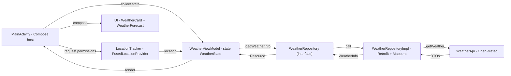

# 🌦️ Weather App — MVI + Jetpack Compose (Android)

A modern Android weather app demonstrating **unidirectional data flow (MVI-like)** with **Jetpack Compose**, **Hilt DI**, and a clean separation between **data / domain / presentation** layers.  
It fetches hourly forecasts from **Open‑Meteo** and renders a Compose UI with a current card and a horizontal hourly forecast.

> 🕐 This project reflects my Compose + MVI style and is intentionally kept “as‑is” for portfolio purposes.

---

## ✨ Features

- **MVI / Unidirectional data flow** with a single `WeatherState`
- **Jetpack Compose** UI (Material 3): current weather card + hourly forecast
- **Open‑Meteo** hourly API (temperature, weather code, humidity, wind, pressure)
- **Hilt DI** for API, repository, and location tracker
- **FusedLocationProviderClient** for device location
- Kotlin time API (`java.time`) for parsing/formatting hours
- Clear `Resource<Success|Error>` result semantics

---

## 🧱 Tech Stack

- **Kotlin**, **Jetpack Compose** (Material 3)
- **Hilt** (DI), **Coroutines**
- **Retrofit** with **MoshiConverterFactory**
- **Google Play Services Location**
- **Open‑Meteo** (no API key needed)

---

## 🗺️ Architecture (layers)

```
Presentation (Compose)    →   Domain (use via repository)   →   Data (Retrofit, DTO→domain mappers)
MainActivity, WeatherVM       WeatherRepository (interface)     WeatherApi, DTOs, mappers, impl
```

**State model:**
```kotlin
data class WeatherState(
    val weatherInfo: WeatherInfo? = null,
    val isLoading: Boolean = false,
    val error: String? = null
)
```

**Result wrapper:**
```kotlin
sealed class Resource<T>(val data: T? = null, val message: String? = null) {
    class Success<T>(data: T?): Resource<T>(data)
    class Error<T>(message: String, data: T? = null): Resource<T>(data, message)
}
```

---

## 🔌 API

- **Base URL:** `https://api.open-meteo.com/`
- **Endpoint:** `GET /v1/forecast?hourly=temperature_2m,weathercode,relativehumidity_2m,windspeed_10m,pressure_msl`
- **Params:** `latitude`, `longitude`
- **Auth:** none (public API)

DTOs are mapped to domain models with `WeatherType.fromWMO(code)` for consistent icons/labels.

---

## 📦 Packages & Key Files

```
app/
 └─ src/main/
     ├─ AndroidManifest.xml
     ├─ java/com/crazycats/weatherappmvicompose/
     │   ├─ WeatherApp.kt                     // @HiltAndroidApp
     │   ├─ data/
     │   │   ├─ location/DefaultLocationTracker.kt
     │   │   ├─ mappers/(toWeatherDataMap, toWeatherInfo).kt
     │   │   ├─ model/WeatherDto, WeatherDataDto
     │   │   ├─ remote/WeatherApi.kt
     │   │   └─ repository/WeatherRepositoryImpl.kt
     │   ├─ di/
     │   │   ├─ AppModel.kt                   // Retrofit + FusedLocation provider
     │   │   ├─ LocationModule.kt             // bind LocationTracker
     │   │   └─ RepositoryModule.kt           // bind WeatherRepository
     │   ├─ domain/
     │   │   ├─ location/LocationTracker.kt
     │   │   ├─ repository/WeatherRepository.kt
     │   │   ├─ util/Resource.kt
     │   │   └─ weather/(WeatherInfo, WeatherData, WeatherType).kt
     │   └─ presentation/
     │       ├─ MainActivity.kt               // Compose host
     │       ├─ WeatherViewModel.kt           // state holder
     │       ├─ model/WeatherState.kt
     │       └─ screens/
     │           ├─ WeatherCard.kt
     │           ├─ WeatherForecast.kt
     │           ├─ HourlyWeatherDisplay.kt
     │           └─ WeatherDataDisplay.kt
     └─ res/ (drawables, strings, themes, icons, etc.)
```

---

## 🔄 Data Flow



> GitHub Mermaid-friendly: each edge and label is on its own line to avoid parser errors.

---

## 🖥️ UI Overview

- **WeatherCard**: big icon, current temperature, description, and metrics (pressure, humidity, wind)
- **WeatherForecast**: horizontal hourly list (`LazyRow`) with time, icon, and temperature
- Colors from theme: `DarkBlue`, `DeepBlue`

---

## 📲 Permissions

Declared in `AndroidManifest.xml`:
- `INTERNET`
- `ACCESS_COARSE_LOCATION`
- `ACCESS_FINE_LOCATION`

Runtime flow uses `ActivityResultContracts.RequestMultiplePermissions` from `MainActivity`.

---

## ▶️ How to Run

1. No API key required (Open‑Meteo).
2. Build & run on a device/emulator with location enabled.
3. Grant location permissions when prompted.
4. App loads current location and fetches hourly forecast automatically.

---

## 📝 Notes

- Time parsing uses `java.time` (`LocalDateTime`, `DateTimeFormatter`).
- The mapping `WeatherType.fromWMO(code)` provides a single source of truth for icons and text.
- Location resolution uses `lastLocation`; you can extend to `getCurrentLocation()` updates if needed.
